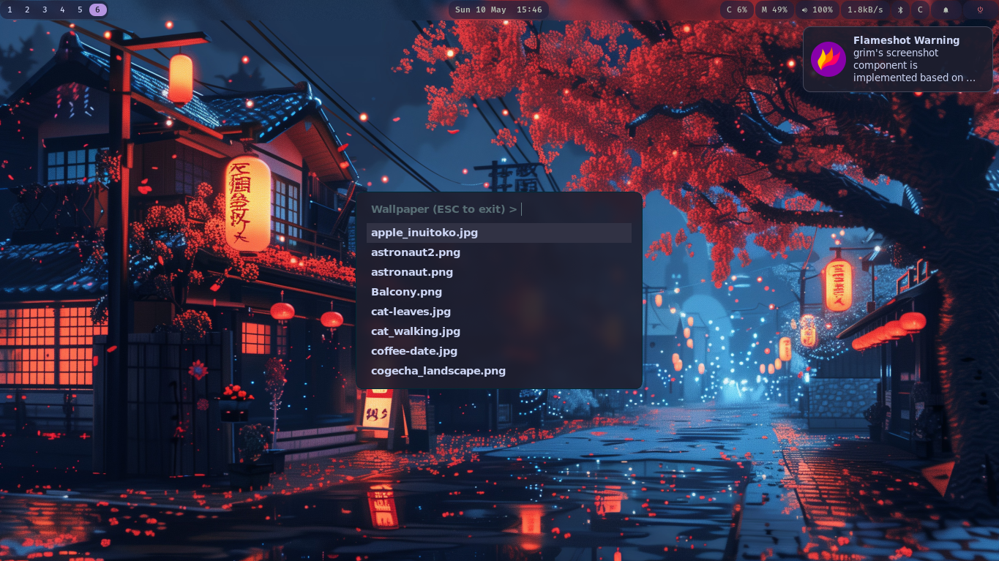

# fuzz-wall

> A minimal, distro-agnostic wallpaper picker powered by [fuzzel](https://codeberg.org/dnkl/fuzzel).

fuzz-wall lets you browse and set wallpapers interactively using fuzzel's dmenu mode.
It auto-detects your wallpaper setter, works on both Wayland and X11, and has zero config files.

 <!-- add a screenshot/gif -->

--- 
## Demo (Watch on youtube)

[Watch on YouTube](https://www.youtube.com/watch?v=WvxNMta54z4)
---

## Features

- Works on **Wayland and X11**
- **Auto-detects** your installed wallpaper setter
- Override wallpaper directory with an **env var** — no config editing
- **No dependencies** beyond fuzzel and a wallpaper setter
- Tiny — just a single POSIX sh script

---

## Supported wallpaper setters

| Setter | Session | Used by |
|---|---|---|
| mpvpaper | Wayland | Hyprland, Sway |
| swaybg | Wayland | Sway |
| awww | Wayland | Hyprland (with fade transitions) |
| swww(retired) | Wayland | Hyprland (with fade transitions) |
| hyprpaper | Wayland | Hyprland |
| feh | X11 | i3, bspwm, dwm |
| nitrogen | X11 | openbox, bspwm |
| xwallpaper | X11/Wayland | general purpose |

fuzz-wall picks whichever one is installed. If you have multiple, it prefers in the order listed above.

---

## Supported WMs & compositors

| WM / Compositor | Session |
|---|---|
| Sway | Wayland |
| Hyprland | Wayland |
| river | Wayland |
| dwl | Wayland |
| i3 | X11 |
| bspwm | X11 |
| dwm | X11 |
| openbox | X11 |
| xfwm | X11 |

---

## Dependencies

**Required:**
- [`fuzzel`](https://codeberg.org/dnkl/fuzzel)

**At least one wallpaper setter/back-end:**
- [`mpvpaper`](https://github.com/GhostNaN/mpvpaper)
- [`swaybg`](https://github.com/swaywm/swaybg)
- [`awww`](https://codeberg.org/LGFae/awww)
- [`swww`](https://github.com/LGFae/swww)
- [`feh`](https://feh.finalrewind.org/)
- [`nitrogen`](https://github.com/l3ib/nitrogen)
- [`xwallpaper`](https://github.com/stoeckmann/xwallpaper)

**Optional:**
- `libnotify` — for error notifications via `notify-send`
- `waypaper` — for selecting the setter/back-end and more features

---

## Install

### AUR (Arch Linux / Arch-based)

```bash
paru -S fuzz-wall
# or
yay -S fuzz-wall
```

### Manual (any distro)

```bash
git clone https://github.com/youngcoder45/fuzz-wall
cd fuzz-wall
chmod +x fuzz-wall
cp fuzz-wall ~/.local/bin/
```

Make sure `~/.local/bin` is in your `$PATH`:
```bash
echo 'export PATH="$HOME/.local/bin:$PATH"' >> ~/.bashrc  # or ~/.zshrc
source ~/.bashrc
```

---

## Usage

```bash
# Pick a wallpaper interactively
fuzz-wall

# Use a custom wallpaper directory
FUZZ_WALL_DIR=~/Pictures/walls fuzz-wall
```

**Controls inside fuzzel:**
- Type to filter wallpapers
- `Enter` to apply
- `ESC` to exit

---

## Configuration

No config file needed. The only option is:

| Env var | Default | Description |
|---|---|---|
| `FUZZ_WALL_DIR` | `~/Pictures/wallpapers` | Directory to pick wallpapers from |

You can set it permanently in your shell rc:
```bash
export FUZZ_WALL_DIR=~/Pictures/walls
```

Or in your WM config (e.g. Hyprland):
```
bind = $mod, W, exec, FUZZ_WALL_DIR=~/Pictures/walls fuzz-wall
```

---

## Binding to a key (examples)

**Sway** (`~/.config/sway/config`):
```
bindsym $mod+w exec fuzz-wall
```

**Hyprland** (`~/.config/hypr/hyprland.conf`):
```
bind = $mod, W, exec, fuzz-wall
```

**i3** (`~/.config/i3/config`):
```
bindsym $mod+w exec fuzz-wall
```

---

## Troubleshooting

**fuzzel not found:**
Install fuzzel from your distro's package manager.
```bash
# Arch
sudo pacman -S fuzzel
```

**No wallpaper setter found:**
Install one of the supported setters listed above.

**Wallpaper directory not found:**
Make sure `~/Pictures/wallpapers` exists, or set `FUZZ_WALL_DIR` to your wallpaper folder.
```bash
mkdir -p ~/Pictures/wallpapers
```

**fuzz-wall command not found:**
Make sure `~/.local/bin` is in your `$PATH` (see install section above).

---

## Contributing

Contributions are welcome! See [CONTRIBUTING.md](CONTRIBUTING.md) for guidelines.

---

## License

MIT © [Aditya](https://github.com/youngcoder45)
